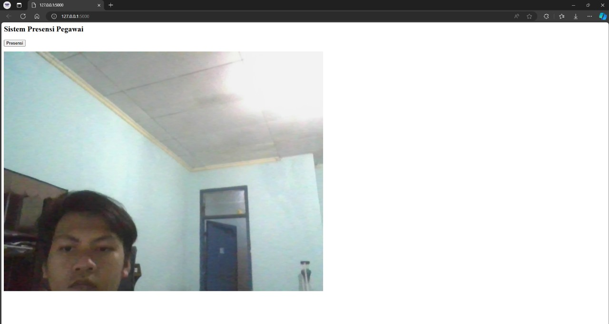
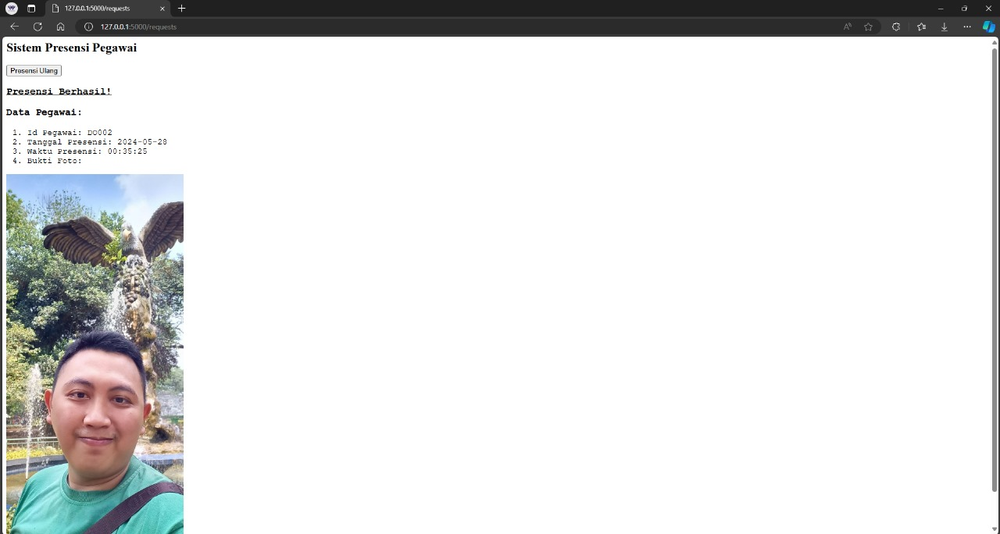

# Sistem Absensi Berbasis Face Recognition
Projek ini merupakan sebuah sistem absensi yang menggunakan konsep face recognition. Sistem ini menangkap wajah karyawan sebagai bukti kehadiran.

Projek ini bertujuan untuk mengembangkan sistem Face Recognition yang akan terintegrasi dengan sistem absensi yang sudah ada, sehingga memungkinkan pencatatan kehadiran karyawan secara otomatis saat wajah mereka terdeteksi.

    <h2> Tabel konten </h2>
    <ul>
        <li>
            <a href="#Instalasi">Panduan Instalasi</a>
        </li>
        <li>
            <a href="#Penggunaan">Panduan Pengguaan</a>
        </li>
        <li>
            <a href="#Model">Pembangunan Model</a>
        </li>
    </ul>

    <h2>
        <a href="#tabel-konten">Panduan Instalasi</a>
    </h2>

Lorem ipsum digidawu

    <h2>
        <a href="#tabel-konten">Panduan Penggunaan</a>
    </h2>

1. Buka terminal
2. Buka file _app_ -> template -> camera_flask_app.py
3. Jalankan file tersebut dengan command "python .\camera_flask_app.py"
4. Terlihat tampilan dari sistem berupa kamera untuk presensi

5. Klik tombol presensi untuk menangkap foto presensi
6. Setelah menekan tombol presensi, maka presensi berhasil dilakukan dengan menampilkan identitas pegawai serta bukti foto

7. Proses presensi berhasil dilakukan dan presensi bisa dilakukan kembali dengan menekan tombol "Presensi Ulang"
8. Untuk keluar dari sistem, kembali ke terminal dan tekan tombol ctrl + C

    <h2>
        <a href="#tabel-konten">Pembangunan Model</a>
    </h2>

Pada sistem ini, model _face recognition_ dibangun menggunakan model _deep learning Convolutional Neural Network_ (CNN). Kode program dapat diakses [di sini](https://github.com/HijazP/sistem-absensi-berbasis-face-recognition/blob/master/model/Face%20Recognition%20Using%20CNN.ipynb). 

Data yang digunakan berupa gambar 18 orang yang diidentifikasi sebagai pegawai untuk sistem absensi yang sudah ada. Data latih model dapat diakses [di sini](https://github.com/HijazP/sistem-absensi-berbasis-face-recognition/tree/master/model/Face%20Images/Face%20Images/Final%20Training%20Images). 
